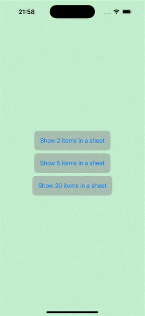

# SwiftUI Dynamic Sheet

A SwiftUI utility to present a customizable bottom sheet with **dynamic height** based on content size. Imagine this: You tap a button, and a sheet appears from the bottom — but it’s not too tall or too short. It fits the content perfectly.

<p align="center">
  
</p>

## 🚀 Features

- ✅ Dynamic height based on content
- ✅ Interactive drag-to-dismiss
- ✅ Simple SwiftUI modifier syntax
- ✅ Works with any SwiftUI view

## 📦 Installation

### Manual

1. Clone or download this repository:
   ```bash
   git clone https://github.com/tungvt-it-92/swiftui-dynamic-sheet.git
   ```
2. Add the Swift files (e.g., `DynamicSheetModifier.swift`) to your Xcode project.


## 🛠 Usage

🧪 Using `.dynamicHeightSheet` in your view
Adding a dynamic, auto-sizing sheet is super simple with the custom modifier. Here’s an example from the ContentView:

```swift
struct ContentView: View {
    @State var isPresented: Bool = false

    var body: some View {
        VStack {
            // Your views 
        }
        .dynamicHeightSheet(isPresented: $isPresented) {
            SheetContent(itemCount: itemCount)
                .presentationDragIndicator(.visible)
        }
    }
}
```

### Implementation Details

Here's the core logic behind `dynamicHeightSheet`:

```swift
struct DynamicHeightSheetModifier<SheetContent: View>: ViewModifier {
    @Binding var isPresented: Bool
    let sheetContent: SheetContent
    @State private var sheetContentHeight: CGFloat = 0

    init(
        isPresented: Binding<Bool>,
        sheetContent: @escaping () -> SheetContent
    ) {
        _isPresented = isPresented
        self.sheetContent = sheetContent()
    }

    func body(content: Content) -> some View {
        content
            .sheet(isPresented: $isPresented) {
                ScrollView {
                    sheetContent
                        .frame(maxWidth: .infinity)
                        .background(
                            GeometryReader { proxy in
                                Color.clear
                                    .task {
                                        updateSheetHeight(proxy.size.height)
                                    }
                                    .onChange(of: proxy.size.height) { newHeight in
                                        updateSheetHeight(newHeight)
                                    }
                            }
                        )
                }
                .presentationDetents([.height(sheetContentHeight)])
            }
    }

    private func updateSheetHeight(_ newHeight: CGFloat) {
        if sheetContentHeight != newHeight {
            sheetContentHeight = newHeight
        }
    }
}

extension View {
    public func dynamicHeightSheet<SheetContent: View>(
        isPresented: Binding<Bool>,
        @ViewBuilder content: @escaping () -> SheetContent
    ) -> some View {
        modifier(
            DynamicHeightSheetModifier(
                isPresented: isPresented,
                sheetContent: content
            )
        )
    }
}
```

## 📚 Read my article for further explanation.

👉 https://medium.com/@tungvt.it.01/%EF%B8%8F-how-to-make-swiftui-sheets-fit-their-content-and-scroll-when-needed-2b55025c1ad1
